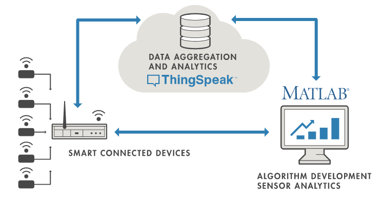

# EX09: Soil moisture monitoring using Thing speak
## AIM
To upload the Soil moisture senso data in the Thing speak using an ESP32 controller.

## APPARATUSN REQUIRED
ESP32 Controller
HC-SR04 Ultrasonic sensor module
Power supply
Connecting wires
Bread board

## PROCEDURE
### ARDUINO
Step1:Open the Arduino IDE
Step2: Go to sketch- include library – manage libraries file and install esp32 and thing speak library file
Step3:Go to file and select new file option
Step4:Type the program and update the thing speak channel ID, API key, wifi password and ID
Step5:Go to file and select save option to save the program
Step6:Go to sketch and select verify or compile options
Step7:If no error Hex file will be generated in the temporary folder
Step8: Connect all the components as per the circuit diagram
Step9: Connect the programming cable with esp32 and PC.
Step10: Check the jumper position and connect 4 & 5 of P4.
Step11. Upload the program in the esp32.
Step12 Press the boot button in ESP32 and then press and release the reset button after release the boot button
Step13 Check the output in the cloud

## THEORY
### What is IOT?
Internet of Things (IoT) describes an emerging trend where a large number of embedded devices (things) are connected to the Internet. These connected devices communicate with people and other things and often provide sensor data to cloud storage and cloud computing resources where the data is processed and analyzed to gain important insights. Cheap cloud computing power and increased device connectivity is enabling this trend.IoT solutions are built for many vertical applications such as environmental monitoring and control, health monitoring, vehicle fleet monitoring, industrial monitoring and control, and home automation

### Sending Data to Cloud with ESP32 and ThingSpeak
ThingSpeak is an Internet of Things (IoT) analytics platform that allows users to collect, analyze, and visualize data from sensors or devices connected to the Internet. It is a cloud-based platform that provides APIs for storing and retrieving data, as well as tools for data analysis and visualization.The Internet of Things ( or IoT) is a network of interconnected computing devices such as digital machines, automobiles with built-in sensors, or humans with unique identifiers and the ability to communicate data over a network without human intervention.Hello readers, I hope you all are doing great. In this tutorial, we will learn how to send sensor readings from ESP32 to the ThingSpeak cloud. Here we will use the ESP32’s internal sensor like hall-effect sensor and temperature sensor to observe the data and then will share that data cloud.
### What is ThingSpeak

It is an open data platform for IoT (Internet of Things). ThingSpeak is a web service operated by MathWorks where we can send sensor readings/data to the cloud. We can also visualize and act on the data (calculate the data) posted by the devices to ThingSpeak. The data can be stored in either private or public channels.ThingSpeak is frequently used for internet of things prototyping and proof of concept systems that require analytics.
### Features of ThingSpeak
ThingSpeak service enables users to share analyzed data through public channels:
ThingSpeak allows professionals to prepare and analyze data for their businesses:
ThingSpeak updates various ThingSpeak channels using MQTT and REST APIs:
Easily configure devices to send data to ThingSpeak using popular IoT protocols.
Visualize your sensor data in real-time.
Aggregate data on-demand from third-party sources.
Use the power of MATLAB to make sense of your IoT data.
Run your IoT analytics automatically based on schedules or events.
Prototype and build IoT systems without setting up servers or developing web software.
Automatically act on your data and communicate using third-party services like Twilio® or Twitter®

## PROGRAM
### Developed by: Shakthi kumar S
### Register number: 212222110043
```c
#include <WiFi.h>
#include "secrets.h"
#include "ThingSpeak.h" // always include thingspeak header file after other header files and custom macros
#define Soil_Moisture 02
char ssid[] = "Anish";   // your network SSID (name) 
char pass[] = "tn758313";   // your network password
int keyIndex = 0;            // your network key Index number (needed only for WEP)
WiFiClient  client;

unsigned long myChannelNumber = 1870717;
const char * myWriteAPIKey = "IXWWM4G5GCKTTQ4Q";

void setup() {
  Serial.begin(115200);  //Initialize serial
  pinMode(Soil_Moisture, INPUT);
  while (!Serial) {
    ; // wait for serial port to connect. Needed for Leonardo native USB port only
  }
  
  WiFi.mode(WIFI_STA);   
  ThingSpeak.begin(client);  // Initialize ThingSpeak
}

void loop() {

  // Connect or reconnect to WiFi
  if(WiFi.status() != WL_CONNECTED){
    Serial.print("Attempting to connect to SSID: ");
    Serial.println(SECRET_SSID);
    while(WiFi.status() != WL_CONNECTED){
      WiFi.begin(ssid, pass); // Connect to WPA/WPA2 network. Change this line if using open or WEP network
      Serial.print(".");
      delay(5000);     
    } 
    Serial.println("\nConnected.");
  }
  /* Soil MoistureSensor */
  int Soil_Value = digitalRead(Soil_Moisture);
  Serial.println(Soil_Value);
  // Write to ThingSpeak. There are up to 8 fields in a channel, allowing you to store up to 8 different
  // pieces of information in a channel.  Here, we write to field 1.
  int x = ThingSpeak.writeField(myChannelNumber, 1, Soil_Value, myWriteAPIKey);
  if(x == 200){
    Serial.println("Channel update successful.");
  }
  else{
    Serial.println("Problem updating channel. HTTP error code " + String(x));
  }
  
  delay(20000); // Wait 20 seconds to update the channel again
}
```
## CIRCUIT DIAGRAM

## OUTPUT


## RESULT
Thus the soil moisture sensor values are uploaded in the Thing speak using ESP32 controller.